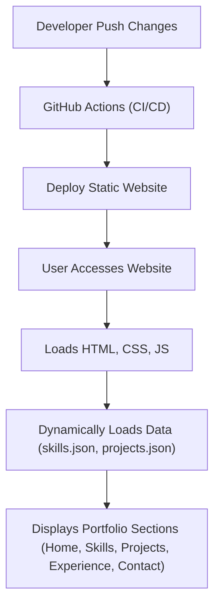

# 🚀 Portfolio Website

<p align="center"></p>

## Short Description

This repository powers a sleek, modern, and dynamic personal portfolio website designed to showcase a developer's skills, projects, and professional experience with elegance and impact. Engineered for clarity and responsiveness, it serves as a robust digital resume, allowing talent to shine and connect with opportunities.

## ✨ Key Features

*   **Dynamic Content Loading**: Skills and project details are effortlessly managed and displayed by loading data directly from structured JSON files (`skills.json`, `projects.json`).
*   **Intuitive Navigation**: Dedicated sections for Home, Skills, Projects, and Experience provide a comprehensive overview of your professional journey.
*   **Interactive User Interface**: Engaging particle effects powered by `particles.min.js` add a modern, dynamic touch to the user experience.
*   **Automated Deployment (CI/CD)**: Seamless integration with GitHub Actions ensures that every push to the repository triggers an automated build and deployment process, keeping your portfolio always up-to-date.
*   **Professional Resource**: Includes an easily accessible and downloadable resume (`assests/resume.pdf`) for quick reference by potential employers.
*   **Custom 404 Page**: A thoughtfully designed custom error page (`404.html`) enhances user experience even when navigating to non-existent pages.

## Who is this for?

This project is ideal for:

*   **Software Developers & Engineers**: Looking for a professional platform to highlight their technical expertise and projects.
*   **Freelancers & Consultants**: Seeking to present their services and past work to potential clients.
*   **Students & Graduates**: Aiming to make a strong first impression with a well-structured online presence.
*   **Anyone building a personal brand**: Who wants a compelling, interactive, and easily maintainable website to showcase their professional identity.

## Technology Stack & Architecture

This portfolio website is built using a modern, efficient, and widely adopted web technology stack:

*   **Frontend**: HTML5, CSS3, JavaScript
*   **Interactivity**: `particles.min.js` for dynamic background effects.
*   **Styling**: Custom CSS (`assests/css/style.css`, `assests/css/404.css`)
*   **Data Management**: Local JSON files (`skills.json`, `projects.json`) for easily editable and updateable content.
*   **Continuous Integration/Continuous Deployment (CI/CD)**: GitHub Actions (`.github/workflows/ci-cd.yml`) for automated testing and deployment.

## 📊 Architecture & Database Schema

The architecture of this portfolio website is designed for simplicity and performance, leveraging a static site approach with client-side data loading.



## ⚡ Quick Start Guide

Getting your local copy of this portfolio website up and running is straightforward:

1.  **Clone the Repository:**
    ```bash
    git clone https://github.com/bhoomikaamrapur-tech/portfolio_website.git
    cd portfolio_website
    ```

2.  **Open in Browser:**
    Simply open the `index.html` file directly in your web browser. All content (skills, projects) will be dynamically loaded from the respective JSON files.

3.  **Customize Content:**
    *   Edit `skills.json` to update your technical proficiencies.
    *   Modify `projects/projects.json` to showcase your latest work.
    *   Replace `assests/resume.pdf` with your own resume.
    *   Update image assets in `assests/images/` and general text in `index.html`, `experience/index.html`, `projects/index.html`.

4.  **Automated Deployment:**
    This repository includes a GitHub Actions workflow (`.github/workflows/ci-cd.yml`) that will automatically deploy your website whenever changes are pushed to the `main` branch. Ensure your GitHub Pages settings are configured correctly for automatic deployment.

## 📜 License

This project is licensed under the terms defined in the `LICENSE` file. Please see the [LICENSE](LICENSE) file for full details.